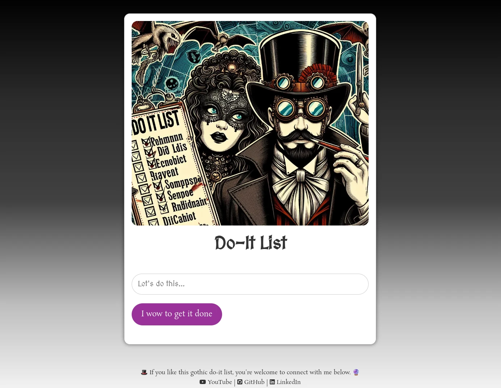

# doItList

## Description

This repo is a practice for creating a list and work with localStorage. The default is a Do-It list in a gothic steampunk style. You can add "its" to do, and remove them when they're done. Feel free to use it.

## Screenshot

